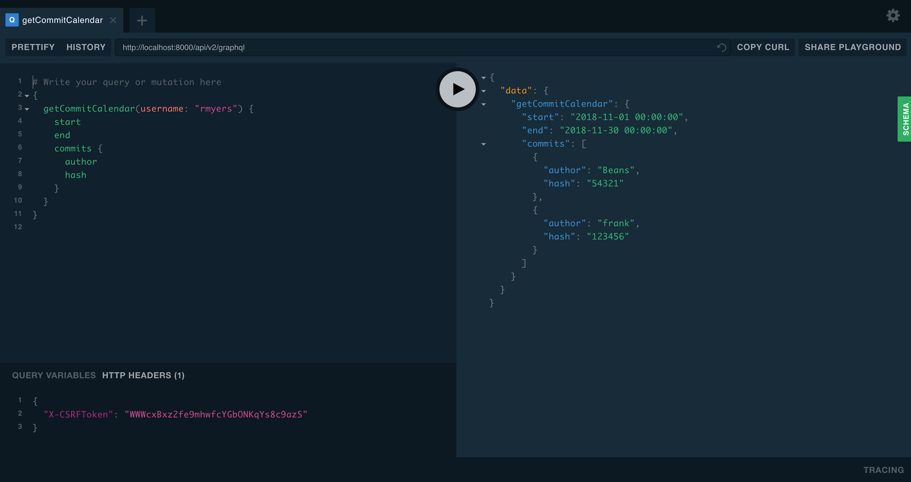
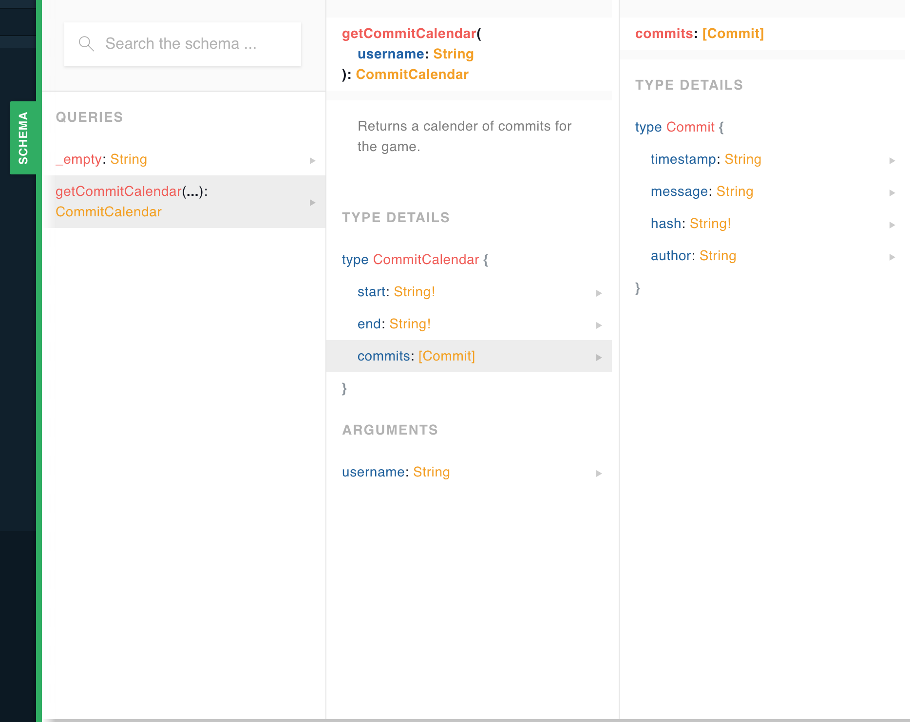

# Pygraph Tutorial {{ config.frankly }}

Everyone likes examples. In this tutorial we will go through a real world
example of converting an existing Django web site to one using pygraph.
Green field tutorials always look great on paper. But how often do you
ever get a chance to do that? If you are like me you have to work within the
system you have in order to make any changes. No manager is willing to let
you code for 6 months while change requests pile up for your existing site.

We are going to take a pragmatic approach to introducing graphql in your
application. With a little bit of work you can hopefully introduce this into
your environment and no one will even notice. Except you will be happy again
because your site will be easier to reason about. Your logic will live on
the server again and you will no longer be slave to NPM and caring about
things like what browsers support various ES6 rules.

Even if you *do* like Javascript, you will appreciate it becoming easier to
maintain. We hope you will learn something and will get more things done
faster with less headaches.

## Re-engineering Effort

(Shameless plug) [Julython](http://julython.org) is a community that gets
together in july to work on opensource projects. It has not received a lot on
attention in the past few years (volunteer time is hard to prioritize). The
site it self is pretty simple but it does interact with the github api and uses
websockets to show progress in real time.

While the site is dormant for 11 months of the year, we can still pretend that
it is under heavy usage and we will introduce our changes incrementally so
we do not have any down time. We need to increase our engagement and provide
a new framework to build on.

Hopefully we can leave the site better than when it started.

## Lay of the Land

First lets have a look at the current state of affairs. Here are the current
list of dependencies and versions we have to work with. It is not pretty and
it is fairly out of date. Attempting to update any single piece of this puzzle
is hard because we haven't been keeping up with these libraries. Since we
have a ton of dependencies that depend on others.

* Server
  * Nginx 1.5
  * Nginx push stream module (websockets) 1.4
  * Ubuntu 14.04
  * gunicorn 1.4
  * Python 2.7.11
* Python Application
  * Django==1.6.1
  * django-tastypie==0.9.15
  * Fabric==1.5.1
  * django-social-auth==0.7.28
  * iso8601==0.1.4
  * django-debug-toolbar==1.3
  * requests
  * South
  * mock
  * jsonfield>=0.9.20
  * pytz
  * pep8
  * markdown
* Client Side
  * backbone.js
  * d3-3.2.0.js
  * jquery-1.7.2.js
  * jquery.timeago-1.3.0.js
  * knockback-0.16.7.js
  * knockout-2.2.0.js
  * pushstream.js
  * underscore-1.4.1.js

So I'm not going to bore you with the nitty gritty details... but I'll update
all the things I can and then report back. You should do the same with your
site, be sure to update your dependencies (I'll wait)

All done? good that was easy j/k

For pygraph to work and the smoothest transition you should be on at least
Python 3.6. That might not be as easy as it sounds. So I'm willing to let
you punt and bring this up as a different service if you need to. Micro-services
for the win! Whether you wish to keep a monolithic application or not is out
of the scope of this tutorial.

I am unable to update to python 3.6 at this time. So we are going to have to
get creative. We can still use graphql but we can't use pygraph 'just yet'.
Since everyone should be using graphql (cause it is the bees knees) I'm first
going to build with the tools I have. Then once we have refactored out a few
things we can safely update our site to use 3.6+ and drop all the old
dependencies.

## Where to Begin? The Hard Way

Okay so we can't use pygraph yet, do you need pygraph at all? How can we do
this without a fancy framework.

I randomly selected the leader board page as a starting page. It is a page
that lists the top 20 people, teams and locations for the current game.

Here is the schema for the existing database tables:

```sql
CREATE TABLE "people_commit" (
    "id" integer NOT NULL PRIMARY KEY,
    "user_id" integer REFERENCES "july_user" ("id"),
    "hash" varchar(255) NOT NULL UNIQUE,
    "author" varchar(255) NOT NULL,
    "name" varchar(255) NOT NULL,
    "email" varchar(255) NOT NULL,
    "message" varchar(2024) NOT NULL,
    "url" varchar(512) NOT NULL,
    "project_id" integer,
    "timestamp" datetime NOT NULL,
    "created_on" datetime NOT NULL,
    "files" text
)
;
CREATE TABLE "people_project" (
    "id" integer NOT NULL PRIMARY KEY,
    "url" varchar(255) NOT NULL,
    "description" text NOT NULL,
    "name" varchar(255) NOT NULL,
    "forked" bool NOT NULL,
    "forks" integer NOT NULL,
    "watchers" integer NOT NULL,
    "parent_url" varchar(255) NOT NULL,
    "created_on" datetime NOT NULL,
    "updated_on" datetime NOT NULL,
    "slug" varchar(50) NOT NULL,
    "service" varchar(30) NOT NULL,
    "repo_id" integer,
    "active" bool NOT NULL
)
;
CREATE TABLE "people_location" (
    "slug" varchar(50) NOT NULL PRIMARY KEY,
    "name" varchar(64) NOT NULL,
    "total" integer NOT NULL,
    "approved" bool NOT NULL
)
;
CREATE TABLE "people_team" (
    "slug" varchar(50) NOT NULL PRIMARY KEY,
    "name" varchar(64) NOT NULL,
    "total" integer NOT NULL,
    "approved" bool NOT NULL
)
;
CREATE TABLE "people_language" (
    "id" integer NOT NULL PRIMARY KEY,
    "name" varchar(64) NOT NULL
)
;
CREATE TABLE "people_userbadge" (
    "id" integer NOT NULL PRIMARY KEY,
    "user_id" integer NOT NULL REFERENCES "july_user" ("id"),
    "badges" text
)
;
CREATE TABLE "game_game" (
    "id" integer NOT NULL PRIMARY KEY,
    "start" datetime NOT NULL,
    "end" datetime NOT NULL,
    "commit_points" integer NOT NULL,
    "project_points" integer NOT NULL,
    "problem_points" integer NOT NULL
)
;
CREATE TABLE "game_player_boards" (
    "id" integer NOT NULL PRIMARY KEY,
    "player_id" integer NOT NULL,
    "board_id" integer NOT NULL,
    UNIQUE ("player_id", "board_id")
)
;
CREATE TABLE "game_player" (
    "id" integer NOT NULL PRIMARY KEY,
    "game_id" integer NOT NULL REFERENCES "game_game" ("id"),
    "user_id" integer NOT NULL REFERENCES "july_user" ("id"),
    "points" integer NOT NULL
)
;
CREATE TABLE "game_board" (
    "id" integer NOT NULL PRIMARY KEY,
    "game_id" integer NOT NULL REFERENCES "game_game" ("id"),
    "points" integer NOT NULL,
    "project_id" integer NOT NULL REFERENCES "people_project" ("id")
)
;
CREATE TABLE "game_languageboard" (
    "id" integer NOT NULL PRIMARY KEY,
    "game_id" integer NOT NULL REFERENCES "game_game" ("id"),
    "points" integer NOT NULL,
    "language_id" integer NOT NULL REFERENCES "people_language" ("id")
)
;
CREATE TABLE "july_user_projects" (
    "id" integer NOT NULL PRIMARY KEY,
    "user_id" integer NOT NULL,
    "project_id" integer NOT NULL REFERENCES "people_project" ("id"),
    UNIQUE ("user_id", "project_id")
)
;
CREATE TABLE "july_user_groups" (
    "id" integer NOT NULL PRIMARY KEY,
    "user_id" integer NOT NULL,
    "group_id" integer NOT NULL REFERENCES "auth_group" ("id"),
    UNIQUE ("user_id", "group_id")
)
;
CREATE TABLE "july_user_user_permissions" (
    "id" integer NOT NULL PRIMARY KEY,
    "user_id" integer NOT NULL,
    "permission_id" integer NOT NULL REFERENCES "auth_permission" ("id"),
    UNIQUE ("user_id", "permission_id")
)
;
```

Or at least that is most of the schema, you don't need to read it closely but
we will use that as a guide for our graphql types.

## Installation

First we need to get the graphql core library installed, as this is the only
prereq that we have:

```bash
$ pip install graphql-core
```

Once you have that installed we can start adding this to our Django views.

## First Query to Migrate

So we have a large application and it is not entirely clear where to start.
One thing I suggest is to see where you are using non-standard api calls or
api calls that combine multiple resources.

There are a few candidates for our demo site, I randomly choose to migrate the
commit calendar code to using graphql. First lets look at the existing code.

Currently the commit calendar is a custom query that counts the commits for
each day and returns start, end, and list of commit objects:

```python
    @classmethod
    def calendar(cls, game, **kwargs):
        """
        Returns number of commits per day for a date range.
        """
        count = cls.objects.filter(
            timestamp__range=(game.start, game.end), **kwargs) \
            .extra(select={'timestamp': 'date(timestamp)'}) \
            .values('timestamp').annotate(commit_count=Count('id'))
        resp = {
            'start': game.start.date(),
            'end': game.end.date(),
            'objects': list(count)
        }
        return resp
```

That is exposed as a non-standard api endpoint (the application is using
tastypie for api now) it looks like this:

```python
class CommitResource(CORSResource):
    user = fields.ForeignKey(UserResource, 'user', blank=True, null=True)
    project = fields.ForeignKey(ProjectResource, 'project',
                                blank=True, null=True)

    class Meta:
        queryset = Commit.objects.all().select_related(
            'user', 'project')
        cache = SimpleCache(timeout=30)
        allowed_methods = ['get']
        filtering = {
            'user': ALL_WITH_RELATIONS,
            'project': ALL_WITH_RELATIONS,
            'timestamp': ['exact', 'range', 'gt', 'lt'],
        }

    def prepend_urls(self):
        return [
            url(r"^(?P<resource_name>%s)/calendar%s$" % (
                self._meta.resource_name, trailing_slash()),
                self.wrap_view('get_calendar'),
                name="api_get_calendar"),
        ]

    def get_calendar(self, request, **kwargs):
        self.method_check(request, allowed=['get'])
        self.throttle_check(request)
        filters = {}

        game = Game.active_or_latest()
        username = request.GET.get('username')
        if username:
            filters['user__username'] = username

        # user = kwargs.get('user', None)
        calendar = Commit.calendar(game=game, **filters)
        return self.create_response(request, calendar)
```

And for completeness here is the SQL for the commit table:

```sql
CREATE TABLE "people_commit" (
    "id" integer NOT NULL PRIMARY KEY,
    "user_id" integer REFERENCES "july_user" ("id"),
    "hash" varchar(255) NOT NULL UNIQUE,
    "author" varchar(255) NOT NULL,
    "name" varchar(255) NOT NULL,
    "email" varchar(255) NOT NULL,
    "message" varchar(2024) NOT NULL,
    "url" varchar(512) NOT NULL,
    "project_id" integer,
    "timestamp" datetime NOT NULL,
    "created_on" datetime NOT NULL,
    "files" text
)
```

### Write the Schema

First we will need to create a schema for Commit and Calendar so that we can
accurately model what is going on. The original code and api sort of glosses
over the fact that these are actually two different resources. It is the
same database but it is a different view of the data :shrug:! We shall fix
that now that we are refactoring things.

Here is the `CommitCalendar` type:

```graphql
type CommitCalendar {
    start: String!
    end: String!
    commits: [Commit]
}
```

And of course we then need a `Commit` type (for now just include the minimum):

```graphql
type Commit {
    hash: String!
    message: String
    author: String
    timestamp: String
}
```

And for the commit calendar we just need to expose a query to fetch it:

```graphql
extend type Query {
    getCommitCalendar(username: String) CommitCalendar
}
```

**NOTE:** We use camelcase here because this is meant to be used by Javascript
          and this help signify that.

### Organization for Those Who Like That Sort of Thing

Where should we put all this stuff? It is really up to you how you want to
organize your application. But I find it is best when you organize your SDL
files by type, that is one major type per graphql file.

Since this is a django project, I'll just create a new 'application':

```bash
$ python manage.py startapp graph
```

We can have circular references in the SDL but if you extend any types those
will need to be extended in order. So we'll just make sure we have a system
that can handle this. The name of the files don't actually matter so I'm going
to suggest that you name them like `001_commit.graphql`. Then if you need
to order them you can just increment the prefix accordingly. So now we have
this structure:

```gql
july/
    /graph
    /graph/gql/001_commit.graphql
    /graph/gql/002_commit_calendar.graphql
    /graph/schema.py
    /graph/resolvers/commit/commit.py
    /graph/resolvers/commit/calendar.py
```

**NOTE:** If you are concerned about discovering your schema, don't because the
          graphql playground does this very well as we will see later.

Okay so to get the schema files in we need to walk the folder and extend the
base schema. Here is what our schema file will look like:

```python
import os

from graphql import build_schema, extend_schema, parse, graphql

ROOT_QUERY = """
  type Query {
    _empty: String
  }
"""

root_schema = build_schema(ROOT_QUERY)

schema_files = os.listdir('gql')
schema_files.sort()

for filename in schema_files:
    with open(os.path.join('gql', filename)) as schema_file:
        schema_data = schema_file.read()
        root_schema = extend_schema(root_schema, parse(schema_data))


# Just expose it as schema so we don't need to remember what we called it.
schema = root_schema
```

Which will parse all the files and extend the root schema. Now all we need
is a base resolver function will will resolve all our custom resolvers and
classes. Oh wait first we need to create those.

### Resolvers

A resolver is pretty simple it just has to adhere to the following spec:

`def resolver(resource: Any, info: Any, *args, **kwargs)`

* `resource`: Is the resource that was resolved, or None.
* `info`: Is the shared context and the parser info.
* `args`: Optional positional args that are passed to the Query or Mutation.
* `kwargs`: Optional keyword args that are passed to the Query or Mutation.

What we hope to acheive at the end of the day is a way to join our schema to
reality. We do that in pygraph with decorators which make it easy for you to
connect the pieces together. That is the glue that binds the disjoined world.
While it is not always easy to see the big picture I hope that you are able to
follow along and learn something.

This tutorial is attempting to show you how it could be done without the
framework. Then we will refactor the code base to use pygraph. To see how it
can help you to organize your code and make it sing.

Then to wrap it up we will sprinkle in a little web components action and you
will be able to program on the web again. And you wont have to learn too much
Javascript. And your code will live on the server again! Happy and caged safe
from prying eyes and 'clients'.

Django ORM is good for pulling out the pieces that we need. I was temped at
first to pull down some raw sql but it is close to what we need. So for the
commit calendar we can just use the existing method and tie that to the
schema. Pretty cool. But how?

Well, all we need to do is to provider our own custom resolver to the excution
of the Query or Mutation. Then as the graph is resolved it will call our
function to 'resolve' things duh!

Here is our `resolver` function:

```python
registry = {}

def resolver(resource, info, **kwargs):
    global registry
    type_name = info.parent_type.name  # GQL schema type (ie Query, User)
    field_name = info.field_name  # The attribute being resolved (ie name, last)
    try:
        # First check if there is a customer resolver in the registry
        # (ie Query:hello, User:last)
        custom_resolver = registry[type_name][field_name]
        return custom_resolver(resource, info, **kwargs)
    except KeyError:
        # If there is not a custom resolver check the resource for attributes
        # that match the field_name. The resource argument will be the result
        # of the Query type resolution. In our example that is the result of
        # the `hello` function which is an instance of the User class.
        return getattr(resource, field_name, None)
```

So now we just need to get things into that registry. The registry should be
a set of factory functions or classes that have a `__call__` method. In
pygraph you would use our decorators but here you can simply import the
things you need and fill in the registry by hand.

By manually populating this registry you also make it much easier to see where
everything is defined. Like this:

```python
from resolvers.commit import calendar

registry = {
    'Query': {
        'getCommitCalendar': calendar.CommitCalendar,
    }
}
```

And that looks a little like this:

```python

from july.people.models import Commit
from july.game.models import Game

class CommitCalendar:
    # start: datetime
    # end: datetime
    # commits: [Commit]

    def __init__(self, username=None):
        # TODO: check info.context for the correct user permissions?
        self.game = Game.active_or_latest()
        self.filters = {}
        if username is not None:
            self.filters['user__username'] = username

        self.start = game.start
        self.end = game.end

    @property
    def commits(self):
        # None -> [Commit]
        # Allow for lazy loading
        calendar = Commit.calendar(game=game, **filters)
        return calendar['objects']


def getCommitCalendar(source, info, username=None):
    return CommitCalendar(username=username)
```

We might choose to just add some functions in the `july.people.models` module
which might make sense as this is but here I'm trying to make it nice and
easy to find all the resolvers.

What happens when you execute the Query"

```gql
query getCommitCalendar(username: $username) {
    start
    end
    commits {
        hash
    }
}
```

1. The middleware classes are called and we return our resolver function.
1. The `resolver` function is called and the `info.parent_type.name = 'Query'`
2. The `info.field_name` is set to `getCommitCalendar`
3. We look up in the registry for `registry['Query']['getCommitCalender']`
4. We return the results of the call `getCommitCalender(resource, info, **kwargs)`
5. We get back an instance of the CommitCalendar class.
6. The resolver is then called again for each of the three `start`, `end`, `commits`
7. For each call the `resource` argument is set to the CommitCalendar
8. For each call the `info.parent_type.name = 'CommitCalendar'`
9. And each call the `info.field_name` is either `start`, `end`, or `commits` but they are called in order
10. Our resolver looks in the registry for `registry['CommitCalendar'][info.field_name]`
11. If we find a custom resolver in the registry we return that call just like `resolver(resource, info, **kwargs)`
12. If there is no custom resolver we fall back to attribute lookups on the `resource` which is the CommitCalendar instance.

As long as all the types match then are results are returned. If there is any
errors in the processing we will return a None or a null in Javascript for that
field.

So now all we need to do is connect this to a view and we can start testing it
out. Since by default all the queries are synchronous there is no reason not
to return it in a normal Django view. In the future we will refactor this to
use the new python async loop. But for now we will just create a simple
view and response.

### Wire this Baby Up {{ book.root }} -- boo

We just need to connect the dots and serve the newly generated schema. To do
that all we need is a new view and url which is easy enough. We'll add a route
to our main `urls.py` like:

`url(r'^api/v2/graphql$', 'july.graph.views.graph', name='graph'),`

Now our `graph` view looks like this:

```python
import json

from django import http
from django.middleware.csrf import get_token
from django.shortcuts import render_to_response
from django.template import Context
from graphql import get_default_backend

from resolver import resource_registry
from schema import schema


def get_graphql_params(request, data):
    query = request.GET.get("query") or data.get("query")
    variables = request.GET.get("variables") or data.get("variables")

    operation_name = request.GET.get("operationName") or data.get("operationName")
    if operation_name == "null":
        operation_name = None

    return query, variables, operation_name


def execute_graphql_request(request, data, query, variables, operation_name):
    backend = get_default_backend()
    try:
        document = backend.document_from_string(schema, query)
    except Exception:
        raise

    try:
        return document.execute(
            root=None,
            variables=variables,
            operation_name=operation_name,
            context=request,
        )
    except Exception:
        raise


for _type, resolvers in resource_registry.iteritems():
    type_obj = schema.get_type(_type)
    if type_obj is None:
        continue
    for field_name, resolve_func in resolvers.iteritems():
        field = type_obj.fields.get(field_name)
        if field is None:
            continue
        field.resolver = resolve_func
        field.description = resolve_func.__doc__


def graph(request):
    if request.method == 'GET':
        # All graphql requests are POST, so if it is a GET we can just
        # render the graphql playground.
        ctx = Context({
            # Pass down the csrftoken to the playground so it can be set as
            # the X-CSRFToken header during requests.
            'csrftoken': get_token(request),
        })
        return render_to_response('playground.html', context_instance=ctx)

    elif request.method == 'POST':
        # Do the query and return results
        content_type = request.META.get('CONTENT_TYPE')
        if content_type == "application/graphql":
            print('app/gql')
            data = {"query": request.body.decode()}
        elif content_type == "application/json":
            print('app/json')
            data = json.loads(request.body.decode("utf-8"))
        else:
            return http.HttpResponseBadRequest()

        # execute the query against our schema and resolvers
        query, variables, operation_name = get_graphql_params(request, data)
        results = execute_graphql_request(request, data, query, variables, operation_name)
        content = json.dumps(results.to_dict())
        print(content)
        return http.HttpResponse(content, content_type='application/json')

    raise http.HttpResponseNotAllowed()

```

Now you should be able to start up the development server and load the play
ground up. You can then preform the `getCommitCalendar` query like:

```gql
{
    getCommitCalendar(username: "frank") {
        start
        end
        commits {
            hash
            author
        }
    }
}
```



And you can view the schema by clicking on the tab on the right hand side:



Ok, if you have gotten this far you might as well go the whole 9 yards baby.
Besides teaching you how to graphql effectively, we also wish to make your
future code portable.

> make your future code portable?

What are you talking about mad man? Clearly you have fallen off the wagon.
The best way to make your code portable is to remove all the dependencies.
With Python that is truly easy to do. The language is fairly strong since it
has batteries included for many things. I'm not advocating not using *ANY*
framework. But you should choose them wisely. Even picking something like
[requests](http://docs.python-requests.org/en/master/) seems harmless enough
yet that it a fast moving library with many security fixes. Are you sure you
are up to date or could you update it easily without breaking? :shrug: maybe,
maybe not. Time will tell if you choose wisely or not. If you don't have too
many different requests you actually need to make it is not *that* hard to
do a couple 'by hand' with the built-in httplib module. So why not give it a
shot? If you are thinking about doing a command line tool or a script to run
your integration tests. Make sure you keep that to python only. In fact break
out a makefile and see if you can't do it in a couple lines of bash and make
foo. Adding a command to the Makefile serves a dual purpose. Comments in code
are basically useless when they go out of date or they are written in a language
that you do not read. Americans are extremely lucky that english is the
'standard' language that everyone uses. If it were not *WE WOULD BE SO SCREWED*
because %50 of americans barely know how to speak a different language.

The sooner you stop relying on comments in your code the better your programs
will become. If you don't beleive me check this out. Here is a snippet of a
makefile to run a task. If you know the rules to how a Makefile is written
it will help to read the file.

```makefile
SOIHSL ?= 'sldisl.ssiousl'
YOOUSH := $(shell bash -c 'echo $$RANDOM')

lkjsys:
    python manage.py runserver --settings=$(SOIHSL)

fiislws:
    python pytest --random=$(YOOUSH)

skjsasuincbqy:
    find . -name '*.pyc' -delete
    rm -rf dilwiicl
    rm -rf kjlsls8l
    rm -rf shwl
```

Now I wrote a little bit of gibberish but you can see by the way this is
structured which command does what. It would help if you knew a little bit
about Python, Django and pytest. But it is not totally nessesary. The point
is since you can read the commands that are being run same as the ones you know
you don't need to be able to read the variable names. You know the answer, AND
it can be a guide for all the people you stumble opon your project from afar.
They can instantly see how you are running your code locally. And they can even
offer improvements now that they can see a little into how your project is
structured.

You can even see from the makefile where some temporary files are being removed
you can safely ignore these directory and files. Because if someone would
carelessly type that command `make skjsasuincbqy` they would delete those
directories. It doesn't make *much* sense for the author to have that pointing
at something they truely cared about. Unless they were just fucking with you
of course. But I digress. Any way the fact still remains, you may not speak
the same language as the other person but computers don't care either way.
It is all just ones and zeros and they could give too shits less what we put in
the comments. They only care about the code and so should you!

If you code uses less third party tools then it will stand a better chance of
servival. And take it from me I know what it means to write code that is out
of date as soon as it goes live. Or to work for months on a project and see
the company go a different direction. Too many times I have wasted effort in
one way or another. But if you are on a project that does have a future, it
most likely has a long past. And you are probably staring at that code right
now. Look at how it taugnts you 'tastypie will live for ever!'. No offense to
the authors of `tastypie` but they way we had to integrate with it made it
a big design desicion. Every third party tool you pull in is another design
descision that you make. And if you rely on it it is hard to pull out of the
package if it is not just quite what you needed.

Here is a quick example of what I am talking about. Say you are learn' away
at your handy new best friend `franknbeans`. But there is a huge security hole
in the way it was implemented (or something like that) which you are able to
patch. So you add in a couple crazy hacks to make it right and call it a day.
later the community or maybe even yourself comes up with a generic solution
to the problem you were facing. So that tiny, but *huge* in size of pain change
is now fixed for everyone of the project. WINNING!

You are pretty awesome and you feel good too. You are most likely going to save
the world 1 million hours of wasted time. However, time moves on... and...
there comes a day when you say goodbye you your old friend `franknbeans` you
have moved on and you brain is full of your new found love `beefnbeans` so in
love that you forget about the huge bug you fixed in your code. Since it was
so long ago and you refactored away the check on your side. You might not
even have a test for it, or worse you have a test but it is pourly named so
when the new library is introduced some random test start to fail and you
wonder why until there is a light blub over your head. Then it all comes back
to you and you save the day once again.

Well if you like saving the day, and I sure you do. Why not just save yourself
some trouble and see if you can't write a tool to do it yourself. If you did
that then the security flaw or whatever could be in your code forever.
Security flaw is not the right example for this. However the point is you
loose knowledge of a tool as you move away from it. And the lesser the number
of tools you depend on for a given project the better. Because it is easy to
get lost. The documentation for certain projects is really good, however htat
is not universal and you are usually left with reading the code.

You should make your future code portable by including a Makefile for how to
run it. The Makefile will servive a nuclear blast such as changing your project
from a python based one to a golang based one. That file after the README is
the most important file in the repository. It will tell everyone everything
they need to know about your project. Or at least it should if you do it right.

But this is not about Make this is about using universal tools that are portable
and the new tool on the block is Graphql. And the only way to write portable
code in this new future is to use the SDL. As any graphql engine must be able
to parse this sdl or they can't actually call themselves an engine.

By resisting the urge to pull in a package like graphene-django and start
plugging in your models into it, you will be able to free yourself of your
past problems. Your old models defined how you organized your code of the
past and it ties the models to the database directly. You want to think about
your data in the way that you are using it on the frontend in order to make
your UI function better for your clients.

How do you do that tho? The first way is to step back and look at how your site
is laid out to begin with. Then see if there is any areas that need improvement.
Your team or manager might be able to point you at a few things. The next
step is to devise a plan to remedy that fault.

Say you need to help customers that have to call in to fix a certain problem on
the website. For example we notice that there are a number of people who start
to fill out a form but then they stop for whatever reason and we can't figure
out why. The team shouts at each other for a few days and they all coaeiless
around three main ideas to solve the issue.

Okay we need a way to solve this issue but we don't want to break everyone.
We can do a little A/B testing and see which one is the winner. How can graphql
fix this issue? Well I glad you asked. Because graphql in its very nature allows
us to return a number of different possible queries. And make changing them a
snap. Imagine if you had to write three different copies of the same code for
a REST api. You could end up with a strange endpoint that was hard to document.
However, with graphql you can easily support multiple iterations of the query
that are slightly different but offer a different view of the data. Which is
good for experiments and we can easily just add a new method for each new
query we want to try. Then when the experiment is over we just remove the failed
attempts and move on. The great thing about GraphQL is that you may not have
to throw away much code at all. You could just be deleting the queries you use
to make.

There is also a way to organize your queries so that there are only a certain
number of queries that you can make. Since there is a central handler you can
easily change your system to record what things are actually being used to help
you weed out the queries that you no longer need. Once you have a handle on
which queries are the most used you can then track down some of the pain points
in your code base. You can locate solutions to your bottlenecks and make
everyone happy again.

I think what I am trying to get at here is write your code so that it is easy
to maintain.

### Going to the client

Alright so far the tutorial has focused (well I tried to stay focused at least)
on the server side. What of ever are we supposed to do for the client side.

First if you are impaitent you can skip ahead and see the final application
in the [tutorial](https://github.com/rmyers/pygraph/tree/master/tutorial/legacy).
For the rest of you please bear with me as I rant about Javascipt.

So the main issue I have with Javascript is the dependencies. NPM is a nightmare
to look at. If you install the barebones 'starter' project for a webpack enabled
ReactJS website you could end up installing 800 individual projects in your
node_modules folder. Now I like open source as much as the next guy. But I am
truly skeptical of most things on the internet. You wouldn't click a suspisious
link in an email would you? Why would you willingly download 800 zip/tar/gz
files authored by who knows what?

I don't trust just anyone to my server's data why would you pick that as a base?
so stay away from all that shit.

I am not saying that you should write your client side code in a different
language. I'm suggesting that you steer clear of babel and webpack until you
know you *need* it to get your work done. But chances are you will not need
to do anything that drastic. The world is getting better as the Javascript
language is getting more powerful and the language is growing in core logic
which is helpful to reduce the number of choises you need to make for a given
technology. Browsers are starting to support more of the language itself and
the days of transpiling to support old version of IE are comming to an end.

You can now use a fancy new technology called web components to simply your
client side application. Basically web components are a way to extent the
elements (find a better term for this) that you can add to your html. Using
web components with graphql is a match made in heaven. As you simplify your
backend code to work with your front end code you can now simplify the
front end. What do I mean by all this? Well I'm talking about simplifing
the code on the front end so that you have less dependencies on projects
that may not be around next year. It is really hard to know when your npm stack
is out of date. Unless you know just *EVERYTHING* about js and the different
tools available. Who has time for any of that mess. You have better things to
store in your brain. Like what the hell does *MY* code do? How can you focus on
your code if you need to search google for every other line or call?

So standard tools for the best results. If at worst you pull in babel, I'm okay
with this as it will hopefully be a thing of the past soon. Once the browsers
get their shit together the JS landscape will be a better place. Sure there will
be future improvements that will take time to propogate. But once there is a
critical mass of funcionality you will not need to rely on transpiling your
code to ES5. So while this isn't a tutorial on web components, I would be doing
you a diservice if I didn't teach you it too.

### WEB COMPONENTS WTF!!!!!!

Oh how I do love web components they are simply the bees knees. If I did not
know anything about graphql or shutter if it didn't exist, my new besty would
be web components. Because we can finally make javascript act like it is a true
programming language with imports that work. I mean how long have we dragged
our knuckles on the ground relying on the html to tell our JS where to load
itself from? Imports are a basic part of every language. I can't believe that
i have been programming on the web for 20 years now and global scope is still
a thing. Most *real* languages have a way to namespace different modules to
separate your code from different parts. But for like what seems like forever
JavaScript has kept us in the dark ages with a `var` actually setting global
state and no 'built-in' way to separate to modules.

What does your average web component look like, well here is a nice example:

```javascript
import {LitElement, html} from 'https://unpkg.com/@polymer/lit-element@0.6.3/lit-element.js?module';

class MyElement extends LitElement {

  static get properties() {
    return {
      whales: { type: Number}
    };
  }

  clickHandler() {
    this.whales++;
  }

  // Render method should return a `TemplateResult` using the provided lit-html `html` tag function
  render() {
    return html`
      <style>
        :host {
          display: block;
        }
        :host([hidden]) {
          display: none;
        }
      </style>
      <div>Whales: ${'🐳'.repeat(this.whales)}</div>
      <button @click="${(event) => this.clickHandler(event)}">Click Me to Whale it Up!</button>
      <slot></slot>
    `;
  }

}
customElements.define('my-element', MyElement);
```

What I like about this is it looks and feels a lot like React. Which is nice
because React is popular for a reason. It is easy to use and it *makes* sense
when you read it. It is a little complicated on how it works but the rules are
easy to learn and follow. So if you need to get started it is not that hard
to figure out what your previous developer was thinking.

Now with graphql you can take that one step further by removing the need to
do logic checking on the javascript side. You can instead focus on content
presentation.

> *WHICH IS WHAT HTML WAS DESIGNED FOR*

Lets examine this method a little closer:

```javascript
static get properties() {
  return {
    whales: {type: Number}
  }
}
```

Without knowing anything about how web components work or how the base
lit-element works you may guess what this does. And you might even be right
I'm not sure if I am correct about this or not. But we should replace this
object that is returned with a query and execution from our graphql server
and see if we can't wire this thing together.

I love experiments so how can we do this without breaking everything?

We can use a feature flag to determine whether to show this element or not.

How do we do that?

Well if you use a third party tool like launchdarky you are set and you know
all about features. If not you could try [features](linktoit)

<script type="module" src="../js/webComponents.js"></script>

<my-element whales="5" />

<h2 id="what-now">What ever should we do now?</h2>
